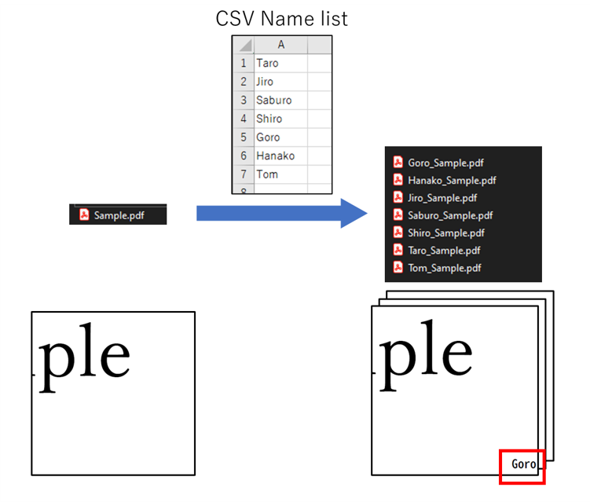
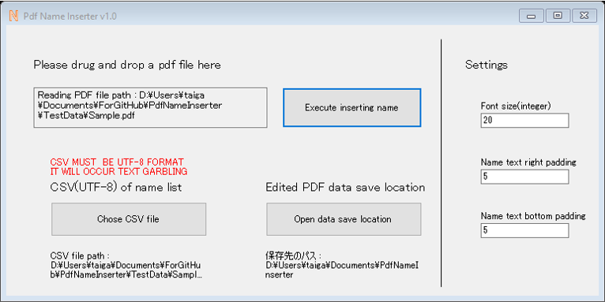

# PDF_Name_Inserter

Program that automatically Inserts names listed as CSV into PDF files.  
CSVにリスト化した名前を一括でPDFに自動挿入するプログラム 

## Description
This automatically inserts names listed as CSV into PDF files at once, It is convenient for distributing credential files.  
For example, if you inserts 5 names into "Sample.pdf", 5 "name_sample.pdf" with names will be gererated and saved in the "sample" folder.  
Names will be inserted in the right-bottom corner of PDF files, and also added to properties of PDF files.

CSVにリスト化した名前を一括でPDFに自動挿入します．社外秘のファイルなどを共有する際に便利です．  
例えば「Sample.pdf」に5人分の名前を挿入すると，名前入りの「名前_Sample.pdf」ファイルが5つ生成され，「Sample」フォルダに格納されます．  
名前はPDFファイルの右下に挿入され，加えてPDFファイルのプロパティにも名前が追加されます．

日本語の[「使い方マニュアル」](images/how_to_use_ja.jpg)も用意してあります．

<b>GUI</b> 

## Requirement

<b>NuGet Package</b> 
[PDFsharp](http://www.pdfsharp.com/PDFsharp/)

Visual Studio  
C# .NET

## Usage
Main process is written in [Form1.cs](PdfNameInserter/Form1.cs)  
Run this project on Visual Studio or run built [exe file](PdfNameInserter/bin/Release/PdfNameInserter.exe) in "Release" folder.

メインの処理は[Form1.cs](PdfNameInserter/Form1.cs)に書かれています．  
Visual Codeでプロジェクトを実行するか，Relaseフォルダ内のビルド済み[exeファイル](PdfNameInserter/bin/Release/PdfNameInserter.exe)を実行してください．

## Licence

[MIT](https://github.com/taiga-n/PDF_Name_Inserter/blob/master/LICENSE)

## Author

[taiga-n](https://github.com/taiga-n)
